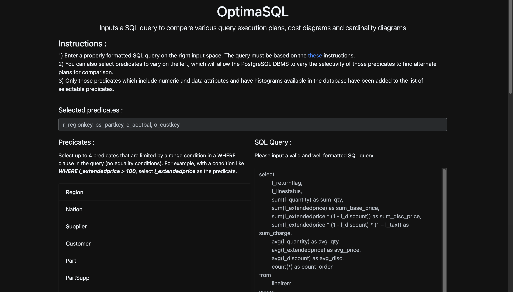

<h1 align="center">Database And Query Optimizer</h1>

An SQL query optimizer that executes an SQL query plan and visualizes its performance



Queries are tested against [TPC-H](http://www.tpc.org/tpch/), a benchmark for generating dummy data in a database that attempts to mimic real world operations.

## Installation and setup

First, clone this repository to a local folder on your computer. This repository contains two main folders - the `/backend` backend (server), and the `/frontend` (client). To ensure that this project runs correctly, we need to set up both the frontend and the backend, then run them concurrently.

1. **Ensure that you have [Yarn](https://yarnpkg.com/getting-started) (A package manager for javascript) and [NodeJS](https://nodejs.org/en/) installed.**
2. Run `yarn install` in this root folder.

## Setting up the frontend

We are using [React](https://reactjs.org/) as well as a few other dependencies for the frontend.

1. Ensure that you have [Yarn](https://yarnpkg.com/getting-started) (A package manager for javascript) installed.
2. `cd` into `/frontend` and run `yarn install` to install the dependencies needed for the client.

Further instructions regarding Frontend setup can be found at [Frontend_README](https://github.com/suchirmv-1524/Database-And-Query-Optimisation/tree/main/frontend)

## Setting up the backend

We are using [Flask](https://palletsprojects.com/p/flask/) to run the web server.

1. Ensure that you have [Poetry](https://python-poetry.org/docs/) (A package manager for Python) and at minimum [Python 3.8](https://www.python.org/downloads/) installed. You can run `pip install poetry` in your environment to install Poetry.
2. `cd` into this folder and run `poetry install` to install the Python package dependencies for this backend. We are using Flask as a web server.
3. By default, the backend server starts in production mode. To run in development mode and enable hot reloading, create an `.env` file in this folder and add the following environment variables:

```bash
FLASK_APP=app.py
FLASK_ENV=development
DB_HOST=localhost     
DB_NAME=TPC_H      
DB_USER=postgres   
DB_PASSWORD=postgres  
DB_PORT=5432      
```
This will ensure that the connection details of your PostgreSQL database is saved

4. You will have to connect to a Postgresql database to run the query. This database should be populated with dummy data generated by [TPC-H](http://www.tpc.org/tpch/). See the [main README](https://github.com/suchirmv-1524/Database-And-Query-Optimisation) if you have not generated the TPC-H dataset.

5. It is recommended that you use this exact configuration for the PostgreSQL database (aka with a database named "TPC-H").

6. To start the backend server, you can run `poetry run flask run` from this folder, or head back up to the `root` folder and run `yarn start`, which starts both the frontend client and the backend server concurrently.

Further instructions regarding Backend setup can be found at [Backend_README](https://github.com/suchirmv-1524/Database-And-Query-Optimisation/tree/main/backend)

## Setting up the database

<br/>1. **Ensure that you have PostgreSQL installed of latest version.**
<br/>2. Go to the [TPC-H](https://github.com/aleaugustoplus/tpch-data) repository and download all these files onto your local system.
<br/>3. Open your terminal, and run the following command to directly preprocess the .tbl file for easy import into the database :
```bash
sed -i '' 's/|$//' /path/to/each/tbl/files
```
and replace the path with each table name downloaded.
<br/> 4. Login to your PostgreSQL CLI and login to your user(postgres) using password(postgres)
<br/> 5. Create database, if not exists, named as `TPC_H`.
<br/> 6. Copy entire contents of dss.ddl` and `dss.ri` into your terminal.
<br/> 7. Run this command to copy the .tbl file and populate the tables defined :
```bash
COPY /table/
FROM '/path/to/table'
DELIMITER '|' 
CSV;
```
Run this for each of the 8 tables defined in the database.
<br/> 8. After this, the database and tables have been defined, now head to the `root` folder and run `yarn start` to run the frontend client and backend server concurrently.

Further instructions regarding database setup can be found at [Database_README](https://github.com/suchirmv-1524/Database-And-Query-Optimisation/tree/main/database)

## Running the application

1. To run both the backend server and the frontend client concurrently, `cd` to the root folder and run `yarn start`. This is the option that you should go with most of the time for the application to work correctly.
2. To run only the backend server, `cd` to `/backend` and run `poetry run flask run`.
3. To run only the frontend client, `cd` to `/frontend` and run `yarn start`.

